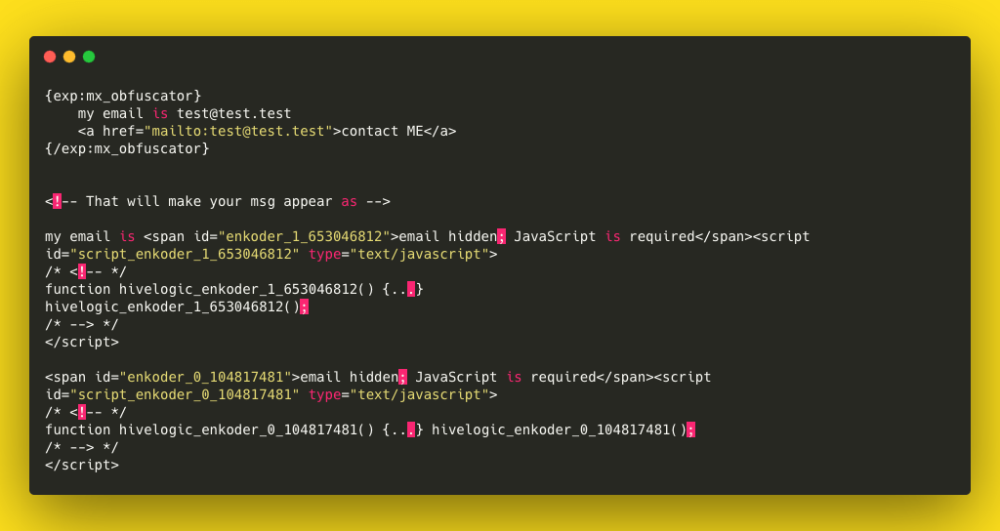

# MX Obfuscator

Simpe ExpressionEngine plugin to encode email addresses so they can't be read by
spambots.

## Installation ##

* Place the **mx_obfuscator** folder inside your **user/addons** folder
* Go to **cp/addons** and install *MX Obfuscator*.

## Tags ##

	{exp:mx_obfuscator}
        my email is test@test.test
        <a href="mailto:test@test.test">contact ME</a>
    {/exp:mx_obfuscator}
    
    
    <!-- That will make your msg appear as -->
	
	my email is email hidden; JavaScript is required
	
	email hidden; JavaScript is required

### Parameters ###

1. encoded_msg - message to show for encoded text (**default:** *"email hidden; JavaScript is required"*)
2. encodeMailto - encode mailtos(**default:** *yes*)
3. encodePlaintextEmails -  encode plaintext emails(**default:** *yes*)

## Support Policy ##

This is Communite Edition add-on.

## Contributing To MX Obfuscator ##

Your participation to MX Obfuscator development is very welcome!

You may participate in the following ways:

* [Report issues](https://github.com/MaxLazar/mx-obfuscator/issues)

## License ##

The MX Obfuscator for ExpressionEngine is open-sourced software licensed under the [MIT license](http://opensource.org/licenses/MIT)

## Thanks To ##
Jonathan Nicol for **StandalonePHPEnkoder** library

Icons made by [Freepik](https://www.flaticon.com/authors/freepik) from [www.flaticon.com](https://www.flaticon.com/)
